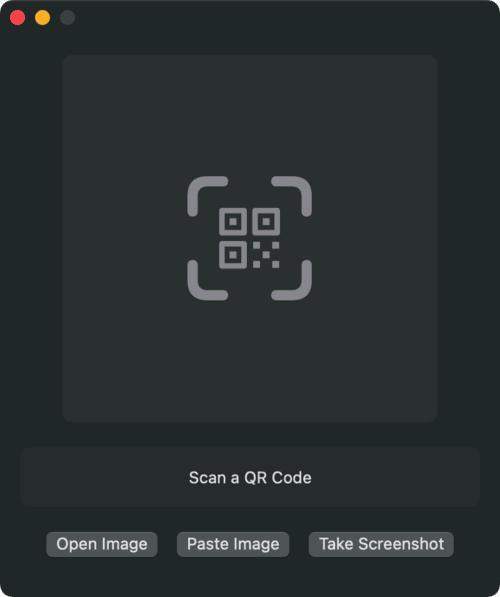

# **QRScanner**

A **macOS** app for scanning QR codes right from your desktop. Capture a screenshot containing a QR code, or open/paste an image to detect and copy the QR code link.

---

## **🚀 Features**  

- **Scan from Screenshot**: Quickly grab a portion of your screen containing a QR code.  
- **Open or Paste Image**: Load an image file or paste from the clipboard to process a QR code.  
- **Copy Link**: Instantly copy the decoded QR code content to your clipboard.  
- **Light/Dark Mode**: Toggle your appearance preference in Settings.  

---

## **🧭 Usage**  

1. **Open the App**: Click the menu bar icon or launch the Dock app window.  
2. **Scan a Code**  
   - **Open**: Choose an image file from disk.  
   - **Paste**: Copy an image to your clipboard and let the app scan it.  
   - **Screenshot**: Select a region of the screen containing a QR code.  
3. **Result**: The detected link will appear in the app window. Click the link to copy it to your clipboard.  

---

## **🛠 Installation**  

1. **Download the DMG** from the Releases page.  
2. **Drag & Drop** the `QRScanner.app` into your **Applications** folder.  
3. **Grant Screen Recording Permission** when prompted (for taking screenshots).  

---

## **📄 License**

This project is licensed under the **MIT License**.

---

## **📝 Credits**  

Developed by **Arnav Podichetty**.  

App icon taken from [macosicons.com](https://macosicons.com/#/?icon=B3QBeoTyWl), made by **octaviotti**.
